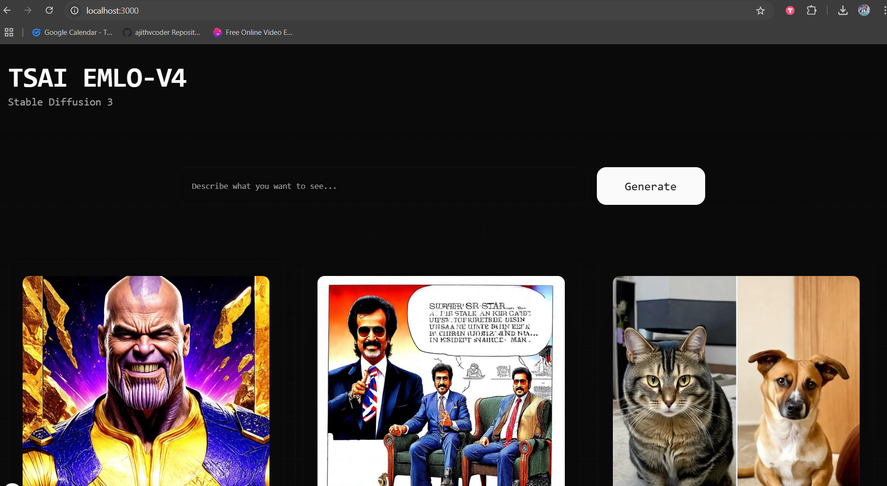
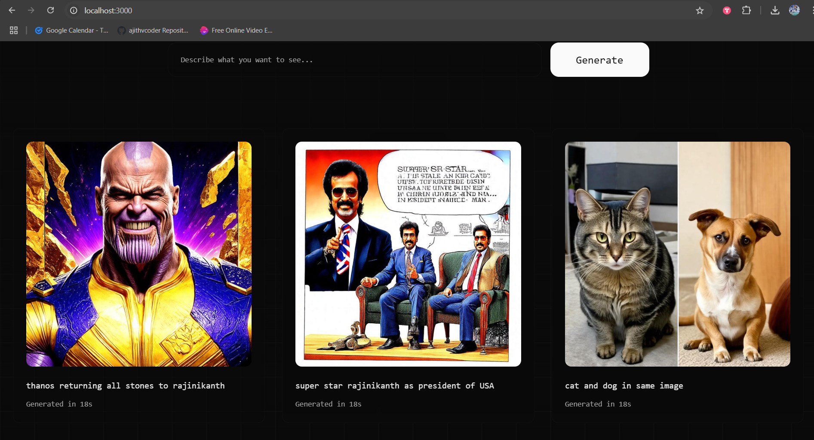

## EMLOV4-Session-12 Assignment - Deployment w/ TorchServe

### Contents

- [Requirements](#requirements)
- [Development Method](#development-method)
    - [Torch Serve Service](#torch-serve-service)
    - [Fast api Service](#fast-api-service)
    - [Web UI Service](#web-ui-service)
    - [Docker compose Development](#docker-compose-development)
    - [Integrating S3](#integrating-s3)
- [Learnings](#learnings)
- [Results Screenshots](#results-screenshots)

### Requirements

- Run TorchServe, FastAPI server with Docker Compose
- Download Model from S3 instead of packaging the model in the .mar file
- Run the Backend and Frontend
- Do 2-3 Generations
- What to Submit
- Logs from TorchServe while Inference
- Screenshots of Inference on Web
- Link to your Github Repository with Backend and Frontend Code (also should have the docker-compose)
- Be patient 🙂, very patient 🙂🙂🙂 with torchserve
- Start on this assignment early

**BONUS** - TODO - Didnt complete it

- Deploy this: https://github.com/ToTheBeginning/PuLID

### Development Method

Bonus assignment - Not successfull

```
git clone https://github.com/ToTheBeginning/PuLID
cd PuLID
copy dev/pulid.py to this dir
pip install -r requirements_fp8.txt
python infer_pulid.py --prompt "portrait, pixar" --id_image images.jpeg --start_step 1 --output result.png

```

When ever i try to infer after 20 to 30 minutes they gpu memory comes around at 10Gb and the process gets killed.

I had only `g6.2xlarge` instance and aws sales team didnt give me `g6.4xlarge` may be there could be a method to solve with`g6.2xlarge` itself by something i didnt explore it stopping the bonus assignment alone here. Also still there is part for writing torch serve handler's init, preprocess, loading model, infer and postprocess.

**Actual assignment** - completed

- EC2 instance : `g6.2xlarge` - 24 GB GPU RAM and 8vCPU - 32 GB RAM

#### Build Command

Start all services with docker compose

- `docker compose up`

Notes:

- Once its started wait for 5 minutes to get `Setting default version to 1.0 for model sd3`

- Then you will get `starting to extract model` or call `curl http://localhost:8080/predictions/sd3?text=dog`
5 minutes for extraction

- it may fail once or twice but it recovers so wait for it to recover and extract successfully

- You will get then `moving pipeline to device`
this will take 5 minutes

- if `http:localhost:3000` is not loading properly after debugging . Go to PORTS in terminal in vscode and click "x" and then do `docker compose restart web_service`

- For clear understanding refer the [logs](./assets/torchserve_logs.txt)

- You can also debug with nvidia-smi command if some python program is utilizing gpu or not after **extaction**

#### Torch Serve Service

**setup**

Inside EC2

```
sudo apt update
sudo apt install unzip curl
```

Download the `stabilityai/stable-diffusion-3-medium-diffusers` model to `sd3-model` folder

```
cd torchserve/

# make sure you have got access to stablityai model repo
python -c "from huggingface_hub.hf_api import HfFolder; HfFolder.save_token('hf_api_token')"

python dev/download_model.py
```

zip the model files and store as sd3-model.zip

```
cd sd3-model
zip -0 -r ../sd3-model.zip *
cd ..
```

Check if a zipped file is created in your local `torchserve/sd3-model.zip` and be in `torchserve` dir

Run a docker file and generate .mar file manually

```
docker run -it --rm --shm-size=1g --ulimit memlock=-1 --ulimit stack=67108864 --gpus all -v `pwd`:/opt/src pytorch/torchserve:0.12.0-gpu bash

# inside docker container

cd /opt/src

# make sure sd3-model.zip is present

ls 

# genrate .mar file

torch-model-archiver --model-name sd3 --version 1.0 --handler sd3_handler.py --extra-files sd3-model.zip -r requirements.txt --archive-format zip-store
```
Above command takes 30 minutes+ and make sure within 15 minutes u r are getting a sd3.mar file in local

```
# now a sd3-model.mar file will be generated and move it to model-store/

mv sd3-model.mar model-store/
```

**Testing torchserve**

```
torchserve --start --ts-config=config.properties --model-store model_store --models sd3=sd3.mar --disable-token-auth --ncs --enable-model-api 
```

- Have a timer in your laptop for this to wait paitently. I did this with g6.2xlarge instance, may be with higher power it may reduce

- Wait for 10 minutes

- Then do `curl http://localhost:8080/ping`, you should get  "un healthy" if u get like this restart the service you will get "healthy"

- Then do `curl http://localhost:8080/predictions/sd3?text=dog`and Wait for 20 minutes it will be extacting model and initalizing the handler and you will get "Initialization completed in 217 seconds" in logs it may fail to initalize for first time but wait it will initalize the next time,  you will get a error that worker has failed after 20 minutes. (because of timeout setting in config.properties) or you would have already got "you would also have got pipeline loaded 100% ." now cacnel the request

- Then do `curl http://localhost:8080/predictions/sd3?text=dog` again and Wait for 10 minutes, you might get inference now

- Only the first inference will be like this, successive inference may take only 30 seconds or less

**Another method of testing with docker**

- You can also run below docker command for testing torchserve

```
docker run --rm --shm-size=1g \
    --ulimit memlock=-1 \
    --ulimit stack=67108864 \
    -p8080:8080 \
    -p8081:8081 \
    -p8082:8082 \
    -p7070:7070 \
    -p7071:7071 \
    --gpus all \
    -v /home/ubuntu/dev/emlo4-session-12-ajithvcoder/torchserve/config.properties:/home/model-server/config.properties \
    --mount type=bind,source=/home/ubuntu/dev/emlo4-session-12-ajithvcoder/torchserve,target=/tmp/models \
    pytorch/torchserve:0.12.0-gpu \
    torchserve --model-store=/tmp/models
```

Note: **--gpus all** is very important else torchserve will take more time for loading and inference and it will face timeout always


- Now you can do `curl http://localhost:8081/models` and get reply

**Test end point**

For first time wait for 15 minutes for this also

- `python test/test_end_point.py`

### Fast api Service

- Install the requirements and start the server

```
cd server
python server.py
```

### Web UI Service

**Next JS project dev method**

- Execute only below if you want to develop Next js UI from scratch

```
npx create-next-app@latest sd3-ui
cd sd3-ui
npm run dev
npx shadcn@latest add card button input
```

- Start web ui server

```
npm install
npm run dev
```

### Docker compose Development

- There are three services `torchserve_service`, `fastapi_service`, `web_service`.

**torchserve_service**

- A common_network is established, volume is mounted where 14 GB .mar file is mounted. We should not copy this file inside docker if we do so it will take a long time to copy and build docker. 

  ```
  networks:
    - common_network
  volumes:
    - ./torchserve/model_store:/workspace/model_store
  deploy:
        resources:
          reservations:
            devices:
              - driver: nvidia
                count: 1
                capabilities: [gpu]
  ```

- Exposing necessary ports

  ```
      ports:
    - "8080:8080"
    - "8081:8081"
    - "8082:8082"
  ```

**fastapi_service**

- To get access to S3 we are establishing below env vairbales

  ```
  AWS_ACCESS_KEY_ID: ${AWS_ACCESS_KEY_ID}
  AWS_SECRET_ACCESS_KEY: ${AWS_SECRET_ACCESS_KEY}
  AWS_REGION: ${AWS_REGION}
  TORCHSERVE_MANAGEMENT_API: http://dtorchserve:8081
  TORCHSERVE_INFERENCE_API: http://dtorchserve:8080
  ```
- Exposing necessary ports
  ```
    ports:
      - "9080:9080"
  ```

**web_service**

- Expose necessary ports to serve

    ```
    ports:
      - "3000:3000"
    ```

### Integrating S3

- I am downloading .mar file directly as i have spent more than 5 dollars on this project and aws is still not giving me a g6.4xlarge mumbai spot instance. In accordance with requirement you need to fetch the 16 GB .zip file from s3 and use torcharchiver to convert it to .mar file and deploy it with docker compose.

- `python download_model_s3.py` will do the job and env variables are provided to torchserve service in docker compose.

### Learnings

- Docker compose

  - if you have a very big file like 14GB dont copy it inside Docker image directly it will take long time for copying both transfer_context and copy takes a long time and consume too much storage and we wont know where to delete it
  so just create a folder in docker image and try to mount from local to there

- Storage handling

  - you can move some files to dir like ` /opt/dlami/nvme` which might have 400Gb space

- Rebuild the a docker service in docker compose

  - Rebuild only a particular service
  `docker compose up -d --no-deps --build <service_name>`

- Using GPU capabilty in docker-compose

    - Add below command in docker compose to enable gpus
    ```
    deploy:
          resources:
            reservations:
              devices:
                - driver: nvidia
                  count: all  # You can use 1 also
                  capabilities: [gpu]
    ```

- Start all services with docker compose

    - `docker compose up`

    Notes:

    - Once its started wait for 5 minutes to get `Setting default version to 1.0 for model sd3`

    - Then you will get `starting to extract model` or call `curl http://localhost:8080/predictions/sd3?text=dog`
    5 minutes for extraction

    - it may fail once or twice but it recovers so wait for it to recover and extract successfully

    - You will get then `moving pipeline to device`
    this will take 5 minutes

    - if `http:localhost:3000` is not loading properly after debugging . Go to PORTS in terminal in vscode and click "x" and then do `docker compose restart web_service`

    - For clear understanding refer the [logs](./assets/torchserve_logs.txt)


**Reference**

- [GPU service in docker compose](https://docs.docker.com/compose/how-tos/gpu-support/#example-of-a-compose-file-for-running-a-service-with-access-to-1-gpu-device)

### Results Screenshots

- Inference logs - [here](./assets/torchserve_logs.txt)

- Docker compose file - [here](./docker-compose.yml)

- Web UI when torchserve_service, fastapi_service, web_service are up






### Group Members

1. Ajith Kumar V (myself)
2. Pravin Sagar
3. Pratyush
4. Hema M
